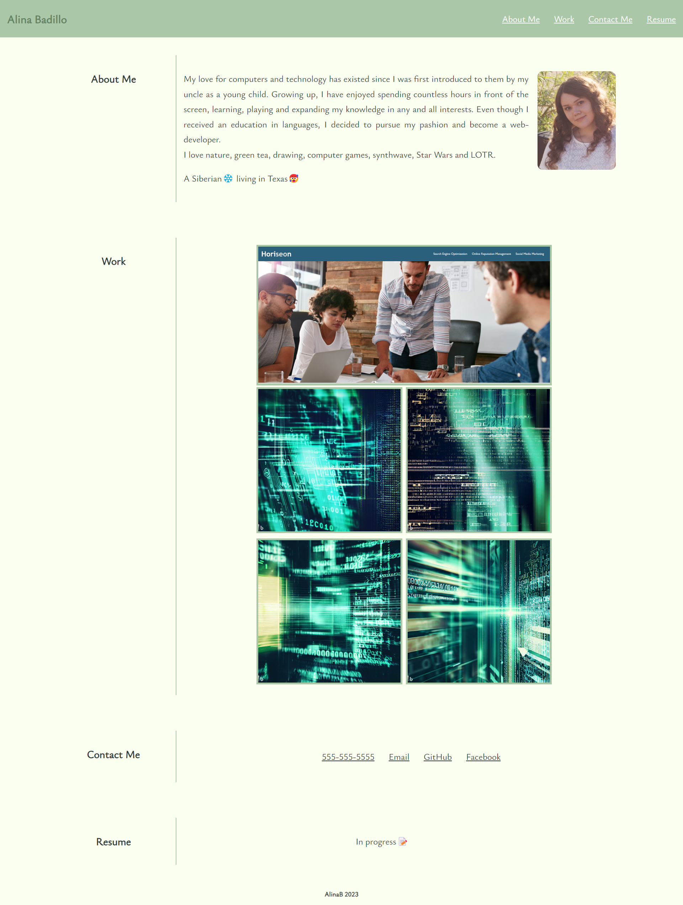

# alinab-personal-portfolio

## Description
A developer's personal portfolio with some personal infromation, examples of past work and contacts.  
Index.html includes few sections:
<ul>
  <li>Header</li>
  <li>Main section</li>
  <li>Footer</li>
</ul>

Header includes a name on the left side and links on the right side. 

Main section includes four parent containers with the same class name for all of them. There are two child containers inside of each parent container. Child-container shows the name of the section and child-container-two shows main the information. 

Every container has flexbox to make elements on the page responsive for different screen sizes.

## Usage
You can find the site here: https://alinab108.github.io/alinab-personal-portfolio/
 

## License

MIT License

Copyright (c) 2023 AlinaB

Permission is hereby granted, free of charge, to any person obtaining a copy
of this software and associated documentation files (the "Software"), to deal
in the Software without restriction, including without limitation the rights
to use, copy, modify, merge, publish, distribute, sublicense, and/or sell
copies of the Software, and to permit persons to whom the Software is
furnished to do so, subject to the following conditions:

The above copyright notice and this permission notice shall be included in all
copies or substantial portions of the Software.

THE SOFTWARE IS PROVIDED "AS IS", WITHOUT WARRANTY OF ANY KIND, EXPRESS OR
IMPLIED, INCLUDING BUT NOT LIMITED TO THE WARRANTIES OF MERCHANTABILITY,
FITNESS FOR A PARTICULAR PURPOSE AND NONINFRINGEMENT. IN NO EVENT SHALL THE
AUTHORS OR COPYRIGHT HOLDERS BE LIABLE FOR ANY CLAIM, DAMAGES OR OTHER
LIABILITY, WHETHER IN AN ACTION OF CONTRACT, TORT OR OTHERWISE, ARISING FROM,
OUT OF OR IN CONNECTION WITH THE SOFTWARE OR THE USE OR OTHER DEALINGS IN THE
SOFTWARE.
